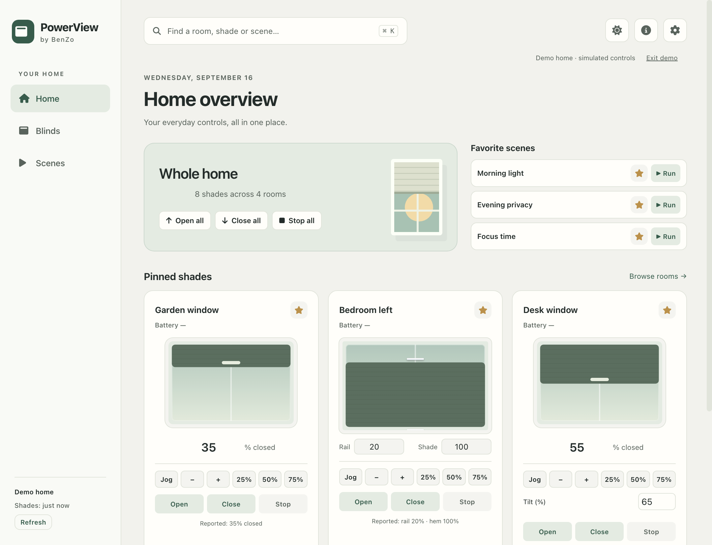

# PowerView by BenZo

A local desktop companion for Hunter Douglas PowerView Gen 3. Control rooms, visual shade positions and existing gateway scenes from your computer.

This update carries the newer local app into GitHub with a redesigned desktop interface: a persistent sidebar, warm light and dark themes, compact shade graphics, Home controls and search. It retains draggable single/dual shade controls, Jog, presets, scenes, room sorting, shortcuts, live events, discovery and the tray menu.



## Run

Use Node.js 22.12 or newer:

```sh
npm ci
npm run demo
```

Demo mode uses simulated devices and a separate settings profile. To connect your home, run `npm start`, open Settings and enter the primary Gen 3 gateway address or use discovery. Only a verified connection replaces the saved address. Existing `PowerView` config and preferences migrate automatically; the old preferences file is retained.

Home puts whole-home actions and favorite scenes above pinned shades, with room shortcuts below. Blinds opens the room grid; Scenes lists your gateway scenes. Search jumps to a room or shade, or runs a matching scene. Shade presets use **percent closed**, matching the number field. A command acknowledgment is separate from the reported position. Stop acts immediately without a confirmation dialog. Room/whole-home movement retains a confirmation and reports partial failures.

Command/Ctrl+K opens search; arrow keys and Enter select a result. Ctrl+B and Ctrl+S switch views; Ctrl+1–9 open rooms in the selected order. Escape closes search or overlays, or returns from a room. Shade graphics support pointer interaction and keyboard adjustment. The tray runs favorite scenes through the same gateway connection, and Settings offers an optional close-to-tray preference.

## Verify and build

```sh
npm run check
npm test
npm run smoke
npm run package
```

The smoke test opens an isolated Electron runtime, uses a temporary profile and a loopback gateway fixture, and does not move real shades. It writes results and native screenshots under `docs/`. `npm run package` creates a local application bundle under `release/`. The existing electron-builder flow is also available through `npm run build:mac` for a DMG. Public distribution still requires signing/notarization and platform/hardware validation.

Advanced gateway tools remain in Settings. To export the gateway's OpenAPI document after enabling Swagger:

```sh
npm run fetch-openapi -- 192.168.1.10
```

The generated document is ignored by Git because it may contain your gateway address.

## Evaluation and compatibility

Read the [revised assessment and feature roadmap](docs/EVALUATION.md) and [validation record](docs/VALIDATION.md). The earlier review of GitHub master described an older version; its missing-feature claims do not describe the newer local app.

The UI and API paths have automated coverage for simulated standard and dual-rail shades, failures, live events, navigation and settings. Physical movement, firmware-specific battery fields and the wider set of shade mechanisms still need testing with actual devices. Gen 1/2 gateways are not supported by this release. No desktop scheduling or automatic glare control is included.

The renderer is sandboxed, has no Node or gateway network access, and communicates through a restricted preload bridge. Icons are bundled locally. Dependencies are locked for repeatable installation.
