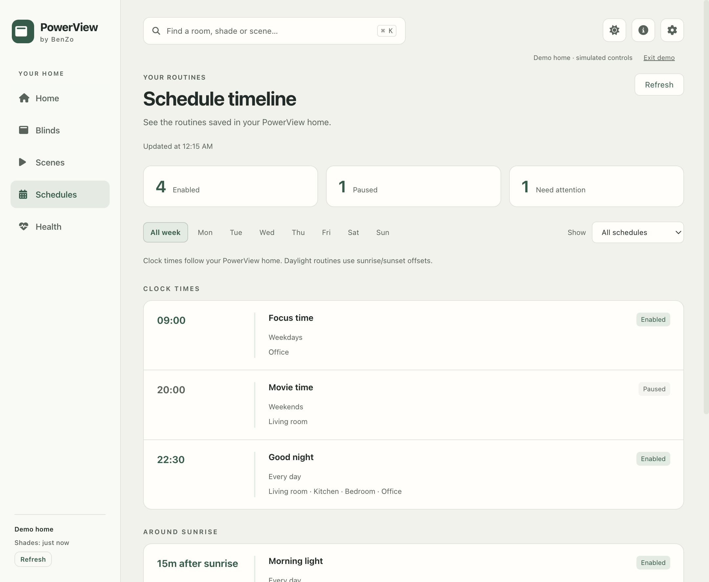
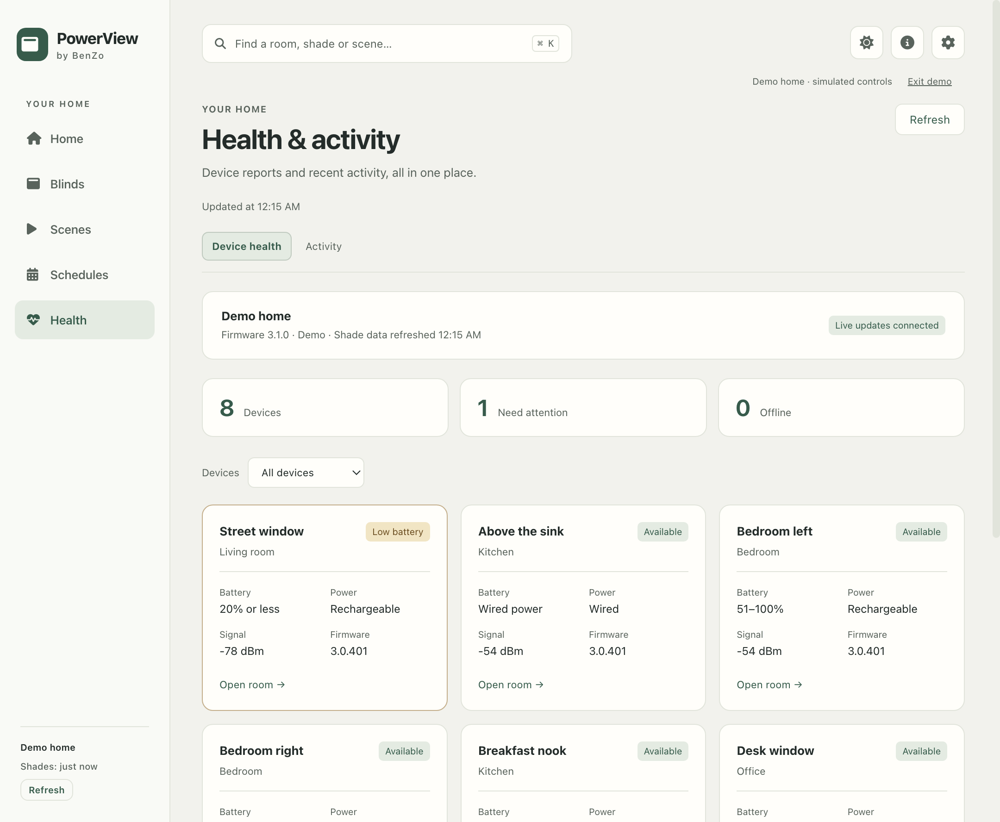
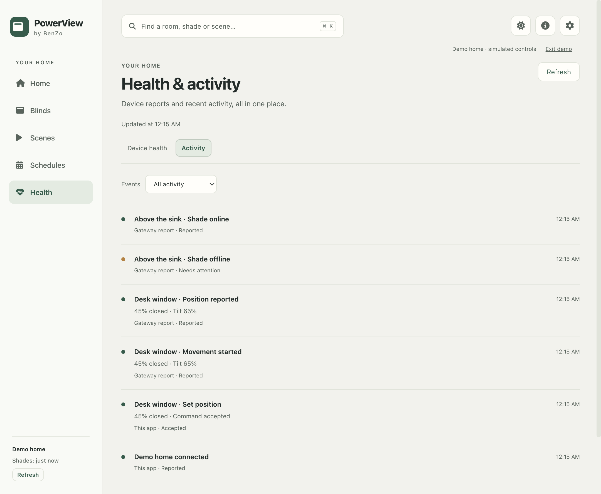

# Schedules, health and activity

Version 1.1.0-beta.8 adds Schedules and Health to the desktop sidebar and narrow-window navigation.

## Schedule timeline

Schedules reads the existing routines saved in the PowerView home. Filter by weekday and by enabled, paused or all schedules. Each entry shows its scene, rooms, recurrence and saved timing. Clock routines are ordered by time; sunrise and sunset routines have separate groups ordered by their signed offsets. Setup failures identify the affected shades, and missing scenes or unknown timing stay visible with an explanation.

The gateway supplies weekday masks and local clock values, but no home timezone or exact solar timestamps through these endpoints. The view consequently shows the saved week and relative daylight offsets without inventing a next-run timestamp, countdown or timezone conversion. Edit routines in the PowerView mobile app. Viewing or refreshing this page cannot change a schedule or move a shade.

Schedules refresh on connection, every minute, on request, and after a HomeDoc change event. A failed optional read does not change the gateway connection state or disable shade controls. Previously loaded schedules remain visible with a stale-data notice; an empty successful list is distinguished from a failed first load. Responses from a previous connection are discarded.

## Health

Device health collects availability, battery, power source, signal and firmware. Offline devices appear first, then low-battery devices and other issues. The Needs attention filter also includes unsupported controls and missing position reports. Open room navigates to the existing controls without sending a command.

Battery codes follow the inspected Gen 3 API 2.13.0 schema: 3 means 51–100%, 2 means 21–50%, 1 means 20% or less, and 0 means depleted. These are approximate ranges, not precise percentages. Wired devices show wired power instead of a battery gauge. Missing readings remain unknown. Signal is the reported RSSI in dBm, without an invented quality threshold. Firmware is shown as reported. The refresh time refers to data retrieved from the gateway, not a claim of direct contact with every motor at that time.

The gateway card shows connection/event-stream status and firmware from `/gateway/info`. Serial numbers and other gateway configuration are not exposed by this new interface.

## Activity

Health → Activity shows app commands, command acceptance or failure, observed movement and position reports, online/offline and battery events, scene activity and connection changes. Commands update one entry as their request resolves. Acceptance is not treated as confirmed movement; a separate gateway event or confirming refresh records the reported position. Repeated timestamped events are deduplicated. The gateway does not identify who initiated movement, so external reports do not name a person, app or schedule as their cause.

Filters show all activity, issues, app commands or gateway reports. History is local to the running app, limited to the latest 200 entries per home and ten homes, and cleared on quit. Switching homes does not mix histories. No activity history is uploaded or written into the preferences file.

## API and validation

The new reads use GET `/home/automations` and GET `/gateway/info`; health uses the existing GET `/home/shades` and `/home/events` stream. HomeDoc and scene-list change events also trigger an existing snapshot refresh. No new write endpoint, integration service, motor command or native schedule mutation is introduced.

Unit coverage includes weekday masks, solar offsets, malformed/unknown schedules, battery ranges, wired power, partial failures, stale responses, isolated and bounded histories, command acknowledgment versus reports, and settlement through refresh. Native coverage exercises filters, room navigation, activity updates, failed and empty schedule reads, desktop/narrow layouts and preservation of keyboard focus during refresh.

A read-only check against the supplied gateway on 17 September 2026 returned 15 shades and 16 schedules (9 enabled), with recognized timing and scene associations for every schedule, no provisioning errors, and a reported gateway firmware value. Physical movement was not exercised. See [the validation record](VALIDATION.md) for the final suite results and remaining field checks.
