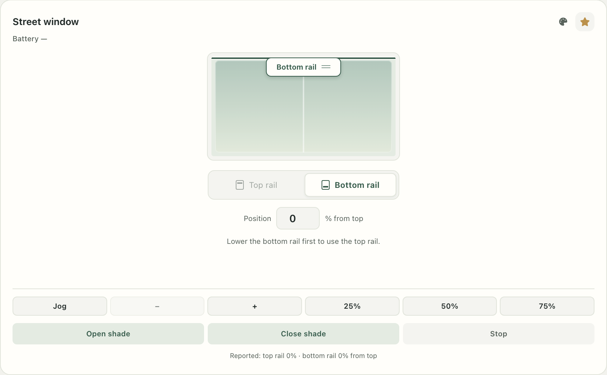
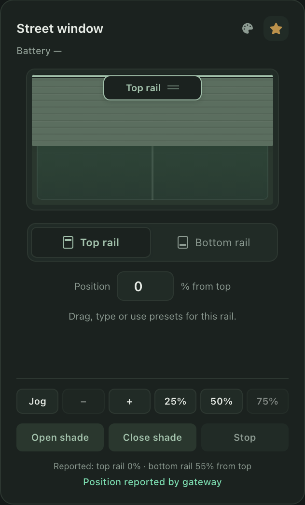
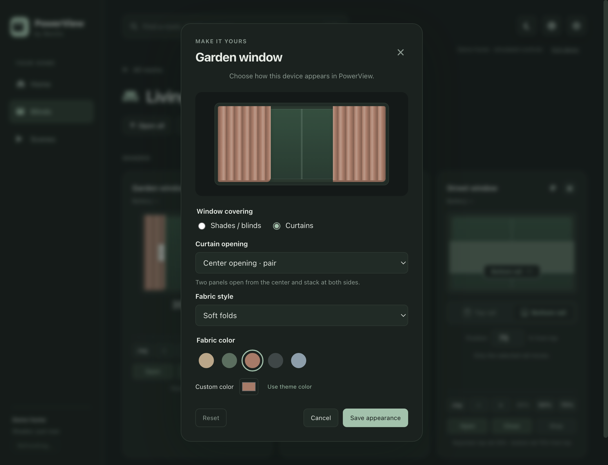
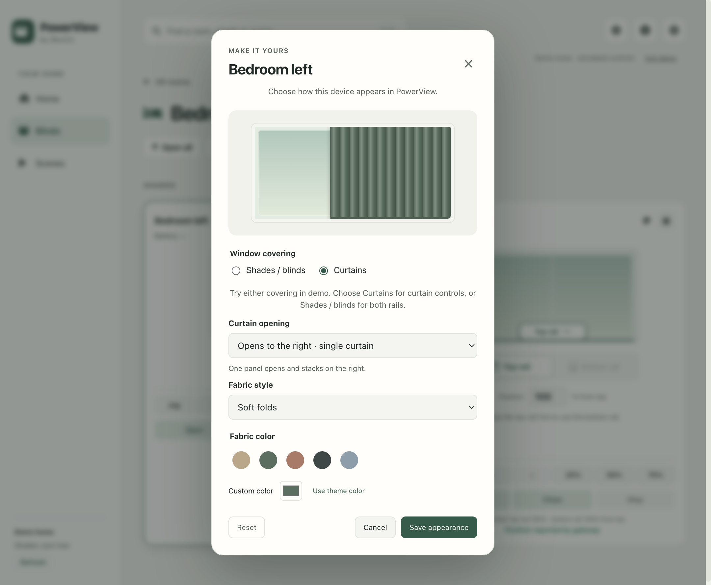

# Shade movement and appearance

The shade card separates the chosen destination from the device's movement. Dragging moves a dashed target and updates the target percentage. Releasing sends one command. Refreshes leave an active drag alone; cancelling a gesture sends nothing. Numeric entry and keyboard controls choose the same target. The solid fabric represents the latest reported position or clearly labeled estimated progress, so it no longer snaps to the destination and back to an older report.

Every visual control has a visible grip at its moving edge, including fully open and closed shades. Curtains have vertical grips on their opening edges: two for a pair, one for a single-draw curtain. Grips follow the displayed physical position; dragging still sets the separate dashed target. Grabbing an inset grip preserves the starting position instead of jumping to the pointer location.

Dual-rail shades use **one centered, labelled grip** with a **Top rail / Bottom rail** selector directly below the window. The selected edge is highlighted. Selecting a rail sends no movement command; dragging anywhere in the preview, arrow keys, the numeric field, nudges and percentage buttons all control that selected rail. The position is measured down from the top of the window. Whole-shade Open, Close and Stop remain separately labelled actions.

When fully raised, Bottom rail is selected and Top rail explains “Lower the bottom rail first.” When both rails are at the bottom, Top rail is selected and Bottom rail explains “Raise the top rail first.” Movement limits use reported positions, keep the rails from crossing and disable presets outside the available range. A selected rail remains selected through refreshes; if it becomes unable to move, the available rail is selected when no drag or numeric edit is active. The same single-handle interaction is used at every position.

## Movement feedback

Gen 3 motion events may include `currentPositions`, `targetPositions` and `targetPositions.etaInSeconds`. When a valid travel time is supplied, the app interpolates from the reported start to the target and labels the intermediate position **approximate**. It waits for the final gateway report to confirm arrival. Acknowledgment alone never confirms a physical position. Cached reads during timed travel, older timestamped events and late acknowledgments cannot rewind the graphic. A short guard also protects a newly reported stop position from stale reads.

The event shape is supported by [first-hand Gen 3 gateway captures in the Hubitat community, posts 243–244](https://community.hubitat.com/t/hunter-douglas-api/39655?page=12). Those logs are implementation evidence, not an official API guarantee. The tests use equivalent loopback HTTP/SSE events; no real motor was operated during this work.

This is not continuous physical position telemetry. Travel speed, motor startup delay, obstructions and multi-rail sequencing can differ from a linear estimate. A missing/invalid travel time leaves the graphic at reported positions instead of inventing a speed. Stop freezes the estimate while awaiting a report. Lost live updates freeze it with an explicit message; bounded follow-up reads check unresolved movement. The actual gateway and representative mechanisms still need field validation.

Demo mode simulates travel and emits the same motion-event shape. It supports intermediate Stop and retargeting, making the interaction testable without connecting hardware.

## Appearance settings

Select the palette button beside a shade's name. Choose shades/blinds or curtains, then a fabric style and color. Curtains offer a center-opening pair or a single-draw curtain that opens and stacks on the left or right. The preview updates immediately; Save appearance applies it to the card and persists it for that device and gateway. Cancel leaves the previous appearance intact. Reset restores the default when saved. Existing saved curtains default to the center-opening pair.

- Shades/blinds: pleated, smooth roller or slatted fabric; vertical target dragging.
- Curtains: soft folds, linen or fine folds; horizontal dragging and animation follow the chosen opening. A pair moves both panels together; a single curtain spans the window from its selected stacking side. Left/right arrow keys follow the fabric edge, while Home opens fully and End closes fully.
- Colors: Natural, Sage, Clay, Charcoal and Mist, a custom color picker, or the theme color.
- Real two-rail shades: texture and color choices retain both rail controls. The editor explains why curtain controls are unavailable for this mechanism.
- Demo two-rail shades, including Bedroom left: Curtains switches the simulated mechanism to a curtain, preserving the uncovered area. Shades / blinds or Reset restores both rail controls. The choice survives restarting demo. Pending commands must finish sending before a mechanism switch; active travel is cleared when switching mechanisms.

Appearance changes send no motor command and do not change a real gateway's device type or capability validation. The demo may change its simulated mechanism to let every demo shade try curtain controls. The editor is available on the visual standard, top-down, vertical and dual-rail controls; tilt-only and overlapped mechanisms retain their existing controls.

